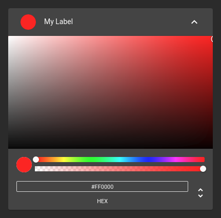

# Configuration Model
To allow users to configure integrations or widgets, a **configuration model** can be defined. The configuration model is a set of input elements mapped to variable names which can be accessed in the intergation or widget code.

To define a configuration model, create a `config.json` and place it in the root directory of the integration or widget.

## Configuration Types
The configuration model must be an array of **configuration types**. A configuration type is an object defining the `type`, `name`, `label` and `default`.

``` json
// config.json
[
  {
    "type": "text",
    "name": "myVariable",
    "label": "My Label",
    "default": "Default value"
  }
]
```

::: warning
Additional fields may be required depending on the configuration type.
:::

In the example above we defined a single text configuration type which can be accessed as `myVariable` in the integration or widget code.

### Text
Renders a simple text field.

| Property | Value    | Required | Description                  |
| -------- | :------: | :------: | :--------------------------- |
| type     | `"text"` | Yes      | The text configuration type. |
| name     | `string` | Yes      | A unique variable name.      |
| label    | `string` | Yes      | Input label.                 |
| default  | `string` | No       | A default text string.       |

Example:

``` json{2}
{
  "type": "text",
  "name": "myVariable",
  "label": "My Label",
  "default": "Default value"
}
```

Output:


### Password
Renders a simple password text field.

| Property | Value        | Required | Description                      |
| -------- | :----------: | :------: | :------------------------------- |
| type     | `"password"` | Yes      | The password configuration type. |
| name     | `string`     | Yes      | A unique variable name.          |
| label    | `string`     | Yes      | Input label.                     |
| default  | `string`     | No       | A default text string.           |

Example:

``` json{2}
{
  "type": "password",
  "name": "myVariable",
  "label": "My Label",
  "default": "Default value"
}
```

Output:


### Color
Renders a color palette.

| Property | Value     | Required | Description                         |
| -------- | :-------: | :------: | :---------------------------------- |
| type     | `"color"` | Yes      | The color configuration type.       |
| name     | `string`  | Yes      | A unique variable name.             |
| label    | `string`  | Yes      | Palette label.                      |
| default  | `string`  | No       | A default color in HTML color code. |

Example:

``` json{2}
{
  "type": "color",
  "name": "myColor",
  "label": "My Label",
  "default": "#FF0000"
}
```

Output:



### Switch

Renders an on / off switch.

| Property | Value      | Required | Description                    |
| -------- | :--------: | :------: | :----------------------------- |
| type     | `"switch"` | Yes      | The switch configuration type. |
| name     | `string`   | Yes      | A unique variable name.        |
| label    | `string`   | Yes      | Switch label.                  |
| default  | `boolean`  | No       | Default switch state.          |

Example:

``` json{2}
{
  "type": "switch",
  "name": "myBoolean",
  "label": "My Label",
  "default": true
}
```

Output:


### Slider
Renders a slider with an adjustable handle.

| Property | Value      | Required | Description                    |
| -------- | :--------: | :------: | :----------------------------- |
| type     | `"slider"` | Yes      | The slider configuration type. |
| name     | `string`   | Yes      | A unique variable name.        |
| label    | `string`   | Yes      | Slider label.                  |
| min      | `number`   | Yes      | Minimum slider value.          |
| max      | `number`   | Yes      | Maximum slider value.          |
| default  | `number`   | No       | Default slider value.          |

Example:

``` json{2}
{
  "type": "slider",
  "name": "myVariable",
  "label": "My Label",
  "min": 0,
  "max": 10,
  "default": 5
}
```

Output:


### Date
Renders a date picker.

| Property | Value    | Required | Description                  |
| -------- | :------: | :------: | :--------------------------- |
| type     | `"date"` | Yes      | The date configuration type. |
| name     | `string` | Yes      | A unique variable name.      |
| label    | `string` | Yes      | Date picker label.           |
| default  | `string` | No       | Default date.                |

Example:

``` json{2}
{
  "type": "date",
  "name": "myDate",
  "label": "My Label",
  "default": "26-07-1994"
}
```

Output:


### Select
Renders a drop-down selector.

| Property | Value      | Required | Description                    |
| -------- | :--------: | :------: | :----------------------------- |
| type     | `"select"` | Yes      | The select configuration type. |
| name     | `string`   | Yes      | A unique variable name.        |
| label    | `string`   | Yes      | Select label.                  |
| options  | `array`    | Yes      | Array of options.              |
| default  | `string`   | No       | Default selection.             |

A select option:

| Property | Value    | Required | Description   |
| -------- | :------: | :------: | :------------ |
| label    | `string` | Yes      | Option label. |
| value    | `string` | Yes      | Option value. |

Example:

``` json{2}
{
  "type": "select",
  "name": "myVariable",
  "label": "My Label",
  "options": [
    {
      "label": "Cats",
      "value": "cat_type"
    },
    {
      "label": "Dogs",
      "value": "dog_type"
    },
    {
      "label": "Fish",
      "value": "fish_type"
    }
  ],
  "default": "dog_type"
}
```

Output:


